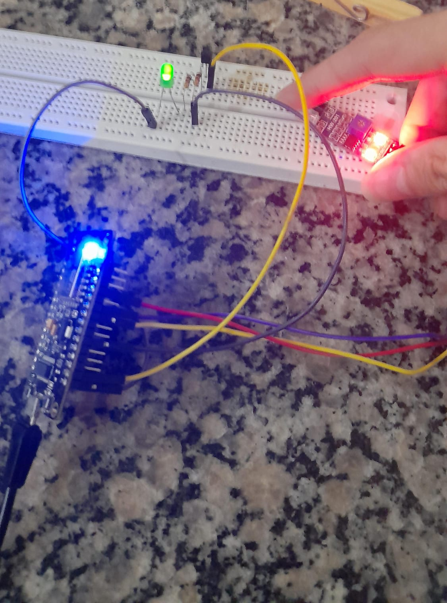

# Organização de luzes no ESP8266

O projeto visa criar uma interface interativa pela rede de wifi provida pelo ESP8266 de maneira assincrona, utilizando de um sensor infravermelho como detector de presença.

O projeto é apenas um protótipo e por causa disso não utiliza de componentes que funcionariam para maiores escalas (como as lampâdas utilizadas nas casas).

## Utilidade e vantagens

A motivação principal para a criação de um sistema como esse é evitar o desperdício de energia.
Considerando um sitema de luzes controlado quase inteiramente digitalmente é possivel manusear e controlar o uso das luzes de forma remota e auxilada por sensores que garantiriam o maximo de eficiência. Como também poderia-se ter uma integração com outros projetos IoT.

## Funcionamento

O funcionamento do projeto é relativamente simples a ESP8266 funciona como um servidor que é capaz de coletar e controlar os componentes eletronicos ao mesmo tempo, enviando esses dados para a seguinte interface:

Essa interface funciona com base em uma pagina na internete hostiada pela própria ESP de forma com que o usuario possa acessa-la em um de seus aparelhos eletrônicos.

Nela são dadas algumas informações sobre os dados coletados durante o tempo em que o sistema permaneceu ligado, assim como a capacidade de ligar e desligar as luzes remotamente, isso ocorre a partir de uma logica de pedidos ao servidor da ESP por comandos em Javascript que pedem ou controlão dados na ESP.

O ligar/desligar o componente de luz é efetuado através de um transistor como switch, no meu projeto eu utilizei de um trasitor 2N2222A e o seguinte circuito: 

Sabendo que no transistor:

$Ic = ib \dot \beta => ibmin = \frac{Ic}{\beta}$

Sendo que:

$Ic = \frac{Vtot - Vtrans - Vled}{1000} = \frac{2}{1000} = 2mA$

$\beta = 100 => ibmin = 0.02mA$

O calculo da resistência da base torna-se:

$\frac{3.3}{2 \cdot 10^{-5}} = 165 000 \Omega$

Portanto qualquer resistor abaixo desse sera o suficiente para fazer com que o transitor fique saturado.

Sendo que a fonte é não ideal eu escolhi o resistor valor de 1K pois eu ja tinha ele e ele não reduziria a tensão geral do circuito muito.

## Imagem do circuito no Fritzing

## Imagen do circuito montado

## Link para o vídeo explicando o projeto

https://www.youtube.com/watch?v=rR7pQTPiGv8

## Bibliotecas/plugins usados

https://github.com/me-no-dev/ESPAsyncTCP
https://github.com/me-no-dev/ESPAsyncWebServer
https://github.com/earlephilhower/arduino-littlefs-upload
https://github.com/bblanchon/ArduinoJson

As partes do código que criei foram feito com base na documentação presente nesses gits.

A ser melhorado

## Feito por

Vinícius Souza Freitas - 15491959
